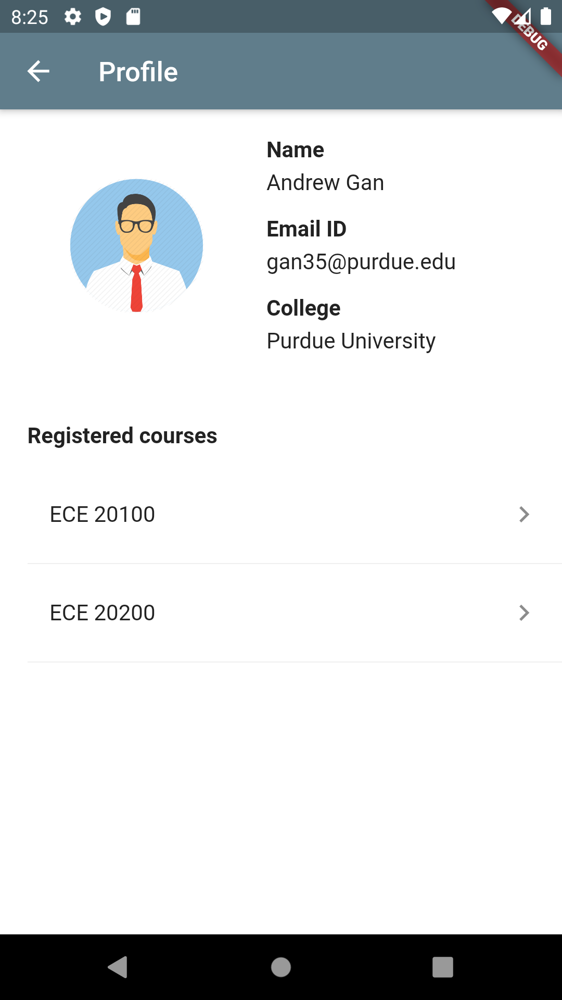
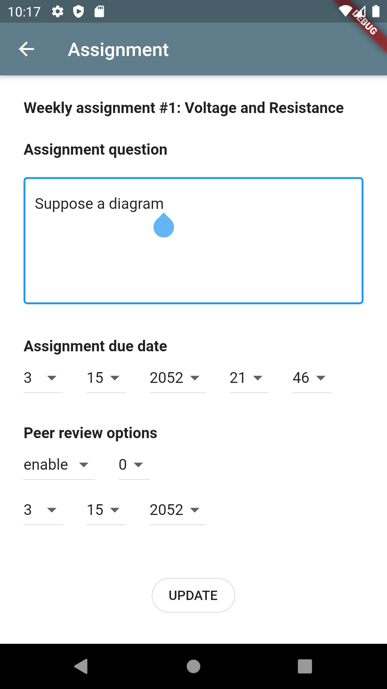

# Techpoint's SOS Challenge
June 22, 2020 - July 24, 2020  

## Team members  
**Go squad (Marketing)** - John Kaufeld, Kaitlin Walper  
**Pro squad (Technical)** - Andrew Gan, [Abdullah Salau](https://github.com/abdullah-salau), [Jaelyn Rogers](https://github.com/jrogers230)  

## Coaches
Kelly Schafka, Eric Freiman, Chris Weiss  
Coach company: [Dewpoint](https://www.dewpoint.com/)  

## Tools
[Flutter](https://flutter.dev/docs) 1.17.5  
[Android Studio](https://developer.android.com/studio) 4.0  
AVD Android 4.1  
[REST API](https://restfulapi.net/)  
[DreamFactory](https://www.dreamfactory.com/)

## Steps
### Setting up the project in a code editor
1. Install the tools required, including the plugins.  
You may refer to this [guide](https://flutter.dev/docs/get-started/install)  
2. In your preferrend code editor, navigate to the folder where the project is stored.  
3. Run 'flutter pub get' and 'flutter pub upgrade' to obtain latest version of dependencies.  
### Running the project on the emulator 
1. Setup AVD in Android Studio.  
You may refer to this [guide](https://developer.android.com/studio/run/managing-avds)  
2. Run the flutter project in the text editor.
3. Select the android emulator from the drop down menu.  
The emulator may timeout while being booted for the first time.  
In which case, perform a second run.
### Running the project on a physical device
1. Connect the physical device to the computer using a USB cable.
2. Enable developer options for your device and then enable USB debugging.  
You may refer to this [guide](https://developer.android.com/studio/debug/dev-options)
3. Run the flutter project in the text editor.
4. Select the android device from the drop down menu.  
  
**Note**: troubleshoot by running the 'flutter doctor -v' command in the terminal.

## Preview
<kbd></kbd>
<kbd></kbd>
<kbd></kbd>

## Documentation
[Documentation for Each1Teach1](https://andrew-gan.github.io/techpoint-sos)  
updated as of July 21 2020

## References
[Item listing and generation](https://codelabs.developers.google.com/codelabs/first-flutter-app-pt1)  
[UI interaction and navigation](https://codelabs.developers.google.com/codelabs/first-flutter-app-pt2)  
[Input fields and design](https://github.com/flutter-devs/flutter_profileview_demo)  
[SQLite data persistence](https://flutter.dev/docs/cookbook/persistence/sqlite)  
[Fetch data using http](https://flutter.dev/docs/cookbook/networking/fetch-data)  
[JSON and serialization](https://flutter.dev/docs/development/data-and-backend/json)  
[HTTP status codes](https://en.wikipedia.org/wiki/List_of_HTTP_status_codes#1xx_Informational_response)  
